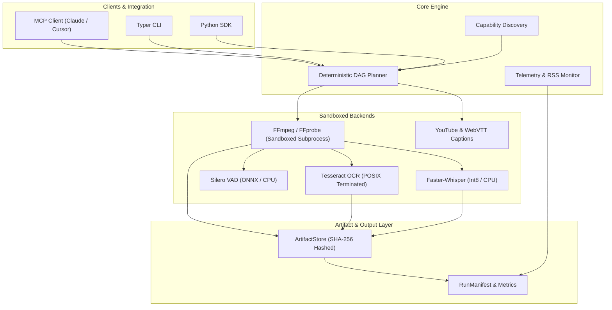

# vidscope

[](https://github.com/DrowsyTM/vidscope/actions/workflows/ci.yml)
[](https://github.com/DrowsyTM/vidscope/actions/workflows/security.yml)
[](https://pypi.org/project/vidscope/)
[](https://pypi.org/project/vidscope/)
[](https://opensource.org/licenses/Apache-2.0)
[](https://scorecard.dev/viewer/?uri=github.com/DrowsyTM/vidscope)

> Local-first, sandboxed video analysis runtime exposing a unified Python API, CLI, and FastMCP server for LLM agents.

---

## Overview

`vidscope` provides deterministic, bounded multimodal video inspection without relying on third-party cloud APIs. Designed specifically for AI agent integration (such as Claude Desktop, Cursor, and custom agentic frameworks), `vidscope` analyzes video streams, extracts keyframes, performs optical character recognition (OCR), extracts native subtitles, detects speech activity (VAD), and runs local automatic speech recognition (ASR) fallback.

### Key Highlights

- **Standard FastMCP Tool Server**: First-class MCP server over standard I/O (`vidscope mcp`), allowing coding assistants and LLMs to inspect videos directly through function calling.
- **Pure Standard Output**: Strict separation of communication channels. FastMCP JSON-RPC messages and CLI JSON envelopes are emitted cleanly to standard output, while diagnostic and operational logs route to standard error.
- **Subprocess Sandboxing**: Hardened execution using `-nostdin` and `-protocol_whitelist "file,pipe,crypto,data"` across FFmpeg and FFprobe backends, plus POSIX option terminators (`--`) for Tesseract.
- **Layered SSRF Protection**: Inbound URL validation rejects private IP ranges (RFC 1918), loopback, link-local (AWS/GCP/Azure instance metadata endpoints), and malformed schemes before any network resolution occurs.
- **Deterministic DAG Planning**: Execution requests are compiled into an ordered dependency graph before processing begins, ensuring bounded execution windows (<=180 seconds), capped frame counts, and strict memory limits.
- **Modular Optional Extras**: Lean base footprint with modular ML extras (`[asr]`, `[vad]`, `[all]`) to prevent unneeded heavy model downloads.

---

## Architecture



---

## System Prerequisites

`vidscope` relies on standard system media utilities:

### Ubuntu / Debian
```bash
sudo apt-get update
sudo apt-get install -y ffmpeg tesseract-ocr tesseract-ocr-eng
```

### macOS (Homebrew)
```bash
brew install ffmpeg tesseract
```

---

## Installation

### Core Package (Lightweight CLI & FastMCP Server)
```bash
pip install vidscope
# or using uv:
uv add vidscope
```

### With Speech & Transcription Extras
```bash
# Local speech transcription (Faster-Whisper + Silero VAD)
pip install 'vidscope[asr]'

# Voice activity detection only
pip install 'vidscope[vad]'

# All features and extras
pip install 'vidscope[all]'
```

---

## FastMCP Configuration (Claude Desktop & Cursor)

### Claude Desktop
Add `vidscope` to your `claude_desktop_config.json`:

```json
{
  "mcpServers": {
    "vidscope": {
      "command": "uvx",
      "args": ["--from", "vidscope[all]", "vidscope", "mcp"]
    }
  }
}
```

### Cursor
Add `vidscope` to `.cursor/mcp.json`:

```json
{
  "mcpServers": {
    "vidscope": {
      "command": "uvx",
      "args": ["--from", "vidscope[all]", "vidscope", "mcp"]
    }
  }
}
```

---

## CLI Usage

### Analyze Video Window
```bash
vidscope analyze-video \
  --source "https://example.com/clip.mp4" \
  --out "./output_dir" \
  --start-seconds 0 \
  --end-seconds 60 \
  --task metadata \
  --task transcript \
  --task frames \
  --task ocr \
  --max-frames 6
```

### Run MCP Server
```bash
vidscope mcp
```

### CLI Options
- `--verbose` / `-v`: Enable verbose debug logging to standard error.
- `--quiet` / `-q`: Suppress non-error logging to standard error.
- `--source`: Local file path or HTTPS video URL.
- `--out`: Staging and artifact output directory.
- `--start-seconds`: Window start time in seconds (default: 0.0).
- `--end-seconds`: Window end time in seconds (default: 180.0, max 180s duration).
- `--task`: Repeatable task flag (`metadata`, `transcript`, `vad`, `frames`, `ocr`).

---

## Python API Usage

```python
from pathlib import Path
from vidscope import (
    AnalysisContext,
    AnalyzeVideoRequest,
    TimeRange,
    analyze_video,
)

request = AnalyzeVideoRequest(
    source="https://example.com/lecture.mp4",
    time_range=TimeRange(start_seconds=10.0, end_seconds=70.0),
    tasks={"metadata", "transcript", "frames", "ocr"},
    output_directory=Path("./runs/run_01"),
    max_frames=6,
    max_frame_width=1280,
    language="en",
)

result = analyze_video(request)

if result.ok:
    print(f"Status: {result.status}")
    print(f"Manifest URI: {result.manifest_uri}")
    for artifact in result.artifacts:
        print(
            f"Artifact: {artifact.artifact_id} -> {artifact.uri} ({artifact.byte_size} bytes)"
        )
    if result.metrics:
        print(f"Peak RSS: {result.metrics.peak_rss_mb} MB")
        print(f"Total Duration: {result.metrics.total_elapsed_ms:.1f} ms")
```

---

## Docker Container

A production container image with non-root security boundaries and pre-installed FFmpeg/Tesseract is available:

```bash
# Pull and run container in MCP mode
docker run -i --rm ghcr.io/drowsytm/vidscope:latest
```

Building locally:
```bash
docker build -t vidscope:latest .
```

---

## Development & Testing

```bash
git clone https://github.com/DrowsyTM/vidscope.git vidscope
cd vidscope

# Sync all development dependencies
uv sync --all-extras

# Linting & code formatting
uv run ruff check .
uv run ruff format --check .

# Static type checking
uv run mypy src tests

# Unit test suite with coverage
uv run pytest --cov=vidscope --cov-report=term-missing

# Run benchmarks
uv run pytest benchmarks/ --benchmark-only
```

---

## Governance & Community

- [Contributing Guidelines](CONTRIBUTING.md)
- [Code of Conduct](CODE_OF_CONDUCT.md)
- [Security Policy](SECURITY.md)
- [Agent & Developer Manual](AGENTS.md)
- [Changelog](CHANGELOG.md)

---

## License

Licensed under the **Apache License, Version 2.0**. See [LICENSE](LICENSE) for details.
